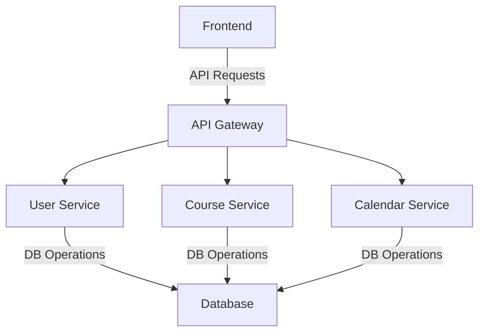
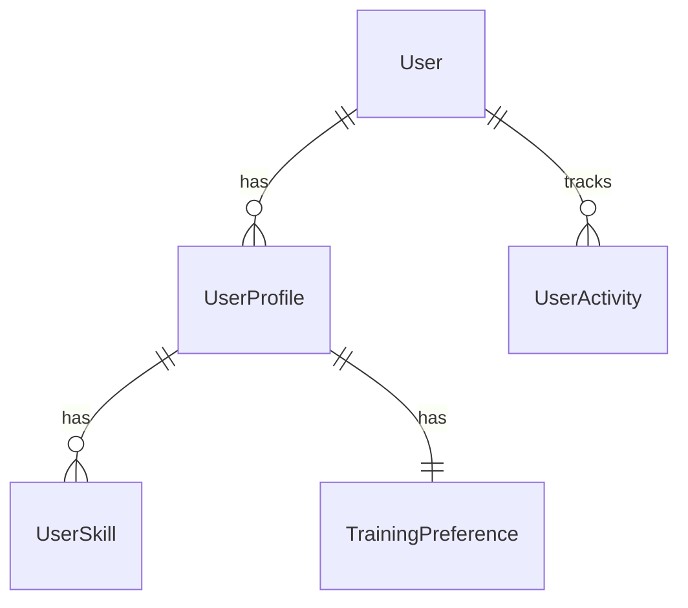
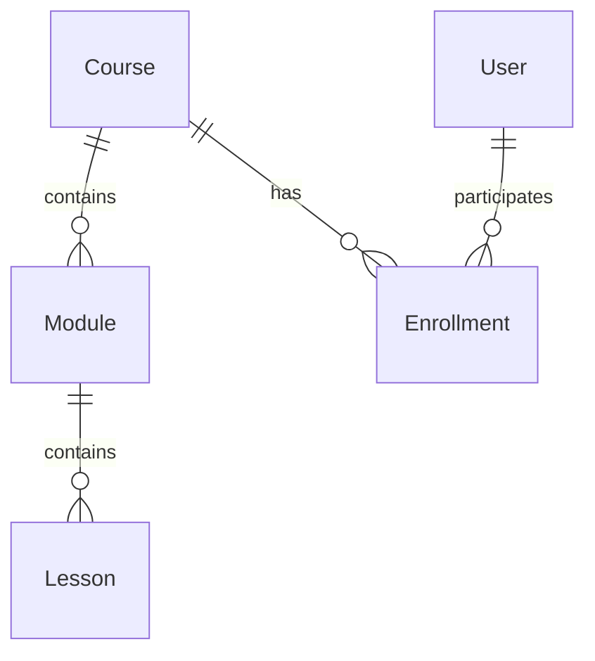
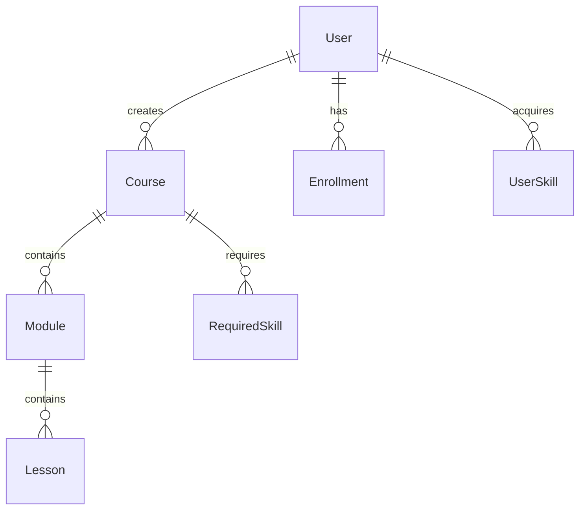

# Training Management System (TMS)
## System Documentation v1.0

## Table of Contents
1. [Introduction](#1-introduction)
2. [System Architecture](#2-system-architecture)
3. [Technical Stack](#3-technical-stack)
4. [Database Design](#4-database-design)
5. [Core Components](#5-core-components)
6. [Security Implementation](#6-security-implementation)
7. [API Documentation](#7-api-documentation)
8. [Testing Strategy](#8-testing-strategy)
9. [Deployment Guide](#9-deployment-guide)

## 1. Introduction

### 1.1 Purpose
The Training Management System (TMS) is a comprehensive platform designed to manage and deliver training programs. It provides functionality for course management, user administration, skill tracking, and progress monitoring.

### 1.2 Scope
The system encompasses:
- User Management with role-based access
- Course Creation and Management
- Skill and Achievement Tracking
- Progress Monitoring
- Assessment Management
- Calendar and Schedule Management

### 1.3 System Overview
The TMS is built using a microservices architecture with Django REST Framework backend and Next.js frontend. It implements advanced features like:
- JWT-based authentication
- Real-time progress tracking
- Advanced user activity monitoring
- Comprehensive skill management
- Achievement system
- File management

## 2. System Architecture

### 2.1 High-Level Architecture
```
Frontend (Next.js)          Backend (Django)           Database
     │                           │                         │
     ├── User Interface          ├── API Layer            ├── PostgreSQL
     ├── State Management        ├── Business Logic       ├── Migrations
     └── API Integration         └── Data Access          └── Indexes
```

### 2.2 Microservices Structure
```
apps/
├── users/              # User Management Service
├── courses/            # Course Management Service
└── calendar_app/       # Calendar Management Service
```

### 2.3 Component Interactions


## 3. Technical Stack

### 3.1 Backend Technologies
- **Framework**: Django 4.2.7
- **API**: Django REST Framework 3.14.0
- **Database**: PostgreSQL 14
- **Authentication**: JWT (djangorestframework-simplejwt)

### 3.2 Key Libraries
```python
# Backend Dependencies
django-cors-headers==4.3.0
django-filter==23.5
django-phonenumber-field==7.3.0
Pillow==10.1.0
django-simple-history==3.4.0
psycopg2-binary==2.9.9
django-environ==0.11.2
```

### 3.3 Frontend Technologies
- **Framework**: Next.js 13+
- **State Management**: React Query
- **UI Components**: Tailwind CSS
- **Authentication**: JWT with HTTP-only cookies

## 4. Database Design

### 4.1 Core Models
#### User Management


#### Course Management

## 4. Database Design (Continued)

### 4.2 Detailed Schema

#### User Management Schema
```sql
-- Core User Table
CREATE TABLE users_user (
    id UUID PRIMARY KEY,
    email VARCHAR(254) UNIQUE NOT NULL,
    role VARCHAR(20) NOT NULL,
    is_active BOOLEAN DEFAULT TRUE,
    created_at TIMESTAMP WITH TIME ZONE,
    updated_at TIMESTAMP WITH TIME ZONE,
    last_active TIMESTAMP WITH TIME ZONE,
    failed_login_attempts INTEGER DEFAULT 0
);

-- User Profile
CREATE TABLE users_userprofile (
    id UUID PRIMARY KEY,
    user_id UUID REFERENCES users_user(id),
    phone_number VARCHAR(128),
    department VARCHAR(100),
    position VARCHAR(100),
    bio TEXT,
    avatar VARCHAR(100),
    skills JSONB,
    preferences JSONB
);

-- Skills and Achievements
CREATE TABLE users_skill (
    id UUID PRIMARY KEY,
    name VARCHAR(100) UNIQUE,
    category VARCHAR(50),
    level_criteria JSONB
);
```

#### Course Management Schema
```sql
-- Course Table
CREATE TABLE courses_course (
    id UUID PRIMARY KEY,
    title VARCHAR(200) NOT NULL,
    code VARCHAR(20) UNIQUE,
    category VARCHAR(20),
    difficulty_level VARCHAR(20),
    duration_weeks INTEGER,
    created_by UUID REFERENCES users_user(id)
);

-- Module Table
CREATE TABLE courses_module (
    id UUID PRIMARY KEY,
    course_id UUID REFERENCES courses_course(id),
    title VARCHAR(200),
    order INTEGER,
    duration_hours INTEGER,
    UNIQUE(course_id, order)
);
```

### 4.3 Data Relationships



## 5. Core Components

### 5.1 User Management System

#### Features
- Role-based access control (RBAC)
- Profile management
- Skill tracking
- Achievement system
- Activity monitoring

#### Code Structure
```
apps/users/
├── models/
│   ├── user.py
│   ├── profile.py
│   └── activity.py
├── views/
│   ├── auth.py
│   ├── profile.py
│   └── admin.py
└── services/
    ├── skill_service.py
    └── achievement_service.py
```

### 5.2 Course Management System

#### Features
- Course creation and modification
- Module and lesson management
- Enrollment handling
- Progress tracking
- Assessment system

#### Code Structure
```
apps/courses/
├── models/
│   ├── course.py
│   ├── module.py
│   └── enrollment.py
├── views/
│   ├── course.py
│   ├── enrollment.py
│   └── assessment.py
└── services/
    ├── progress_service.py
    └── certificate_service.py
```

## 6. Security Implementation

### 6.1 Authentication
```python
REST_FRAMEWORK = {
    'DEFAULT_AUTHENTICATION_CLASSES': (
        'rest_framework_simplejwt.authentication.JWTAuthentication',
        'rest_framework.authentication.SessionAuthentication',
    ),
    'DEFAULT_PERMISSION_CLASSES': (
        'rest_framework.permissions.IsAuthenticated',
    ),
}

SIMPLE_JWT = {
    'ACCESS_TOKEN_LIFETIME': timedelta(minutes=60),
    'REFRESH_TOKEN_LIFETIME': timedelta(days=1),
    'ROTATE_REFRESH_TOKENS': True,
    'BLACKLIST_AFTER_ROTATION': True,
}
```

### 6.2 Permission System
```python
class IsAdminUser(permissions.BasePermission):
    def has_permission(self, request, view):
        return request.user and request.user.role == UserRole.ADMIN

class IsTrainerOrAdmin(permissions.BasePermission):
    def has_permission(self, request, view):
        return request.user and request.user.role in [
            UserRole.TRAINER, 
            UserRole.ADMIN
        ]
```

## 7. API Documentation

### 7.1 Authentication Endpoints
```
POST /api/auth/token/
POST /api/auth/token/refresh/
POST /api/auth/register/
```

### 7.2 User Management Endpoints
```
GET    /api/users/me/
PUT    /api/users/me/
GET    /api/users/profile/
PATCH  /api/users/profile/
GET    /api/users/skills/
POST   /api/users/skills/
```

### 7.3 Course Management Endpoints
```
GET    /api/courses/
POST   /api/courses/
GET    /api/courses/{id}/
PUT    /api/courses/{id}/
GET    /api/courses/{id}/modules/
POST   /api/courses/{id}/enroll/
```

## 8. Testing Strategy

### 8.1 Test Types
1. **Unit Tests**
   ```python
   class UserModelTest(TestCase):
       def test_user_creation(self):
           user = User.objects.create_user(
               email='test@example.com',
               password='testpass123'
           )
           self.assertTrue(user.check_password('testpass123'))
   ```

2. **Integration Tests**
   ```python
   class UserAPITest(APITestCase):
       def test_user_registration(self):
           response = self.client.post('/api/auth/register/', {
               'email': 'test@example.com',
               'password': 'testpass123'
           })
           self.assertEqual(response.status_code, 201)
   ```

3. **End-to-End Tests**
   ```python
   class EnrollmentFlowTest(TestCase):
       def test_complete_enrollment_flow(self):
           # Setup
           self.create_course()
           self.create_user()
           
           # Test enrollment
           self.enroll_user()
           
           # Verify enrollment
           self.verify_enrollment_success()
   ```

### 8.2 Test Coverage
```bash
coverage run manage.py test
coverage report
```

## 9. Deployment Guide

### 9.1 Environment Setup
```bash
# Create virtual environment
python -m venv venv
source venv/bin/activate

# Install dependencies
pip install -r requirements.txt

# Setup database
python manage.py migrate
```

### 9.2 Docker Configuration
```dockerfile
# Dockerfile
FROM python:3.11-slim

WORKDIR /app
COPY requirements.txt .
RUN pip install -r requirements.txt

COPY . .
CMD ["gunicorn", "config.wsgi:application"]
```

```yaml
# docker-compose.yml
version: '3.8'
services:
  web:
    build: .
    ports:
      - "8000:8000"
    depends_on:
      - db
  db:
    image: postgres:14
    environment:
      POSTGRES_DB: tms_db
```


