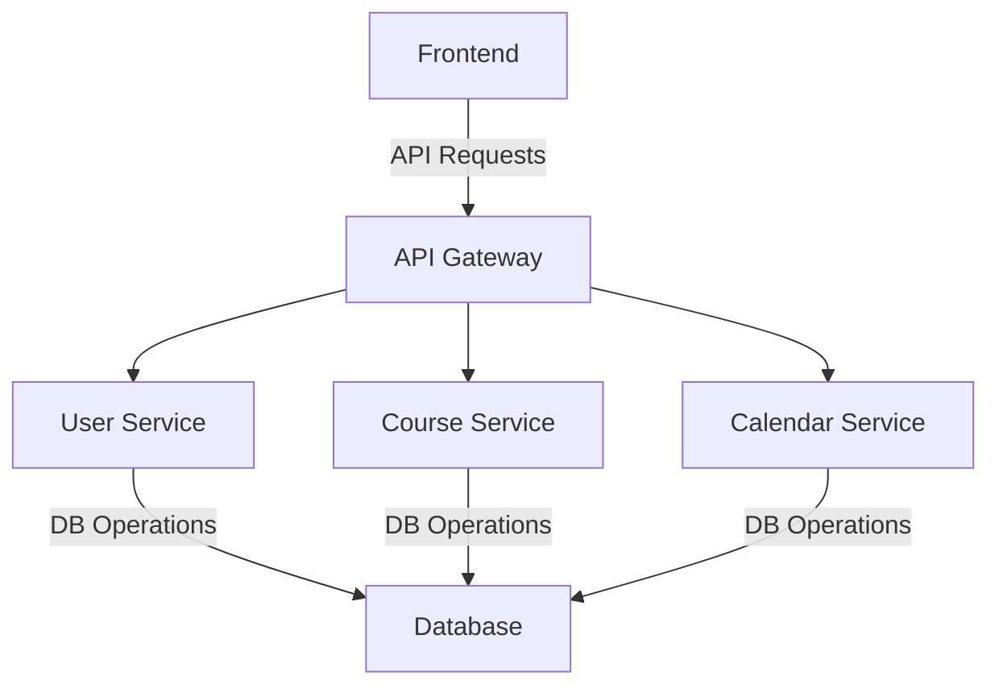
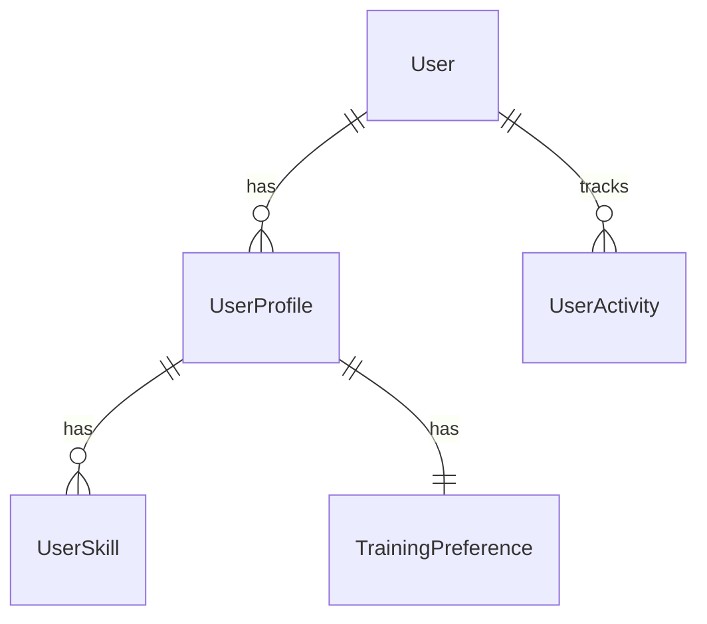
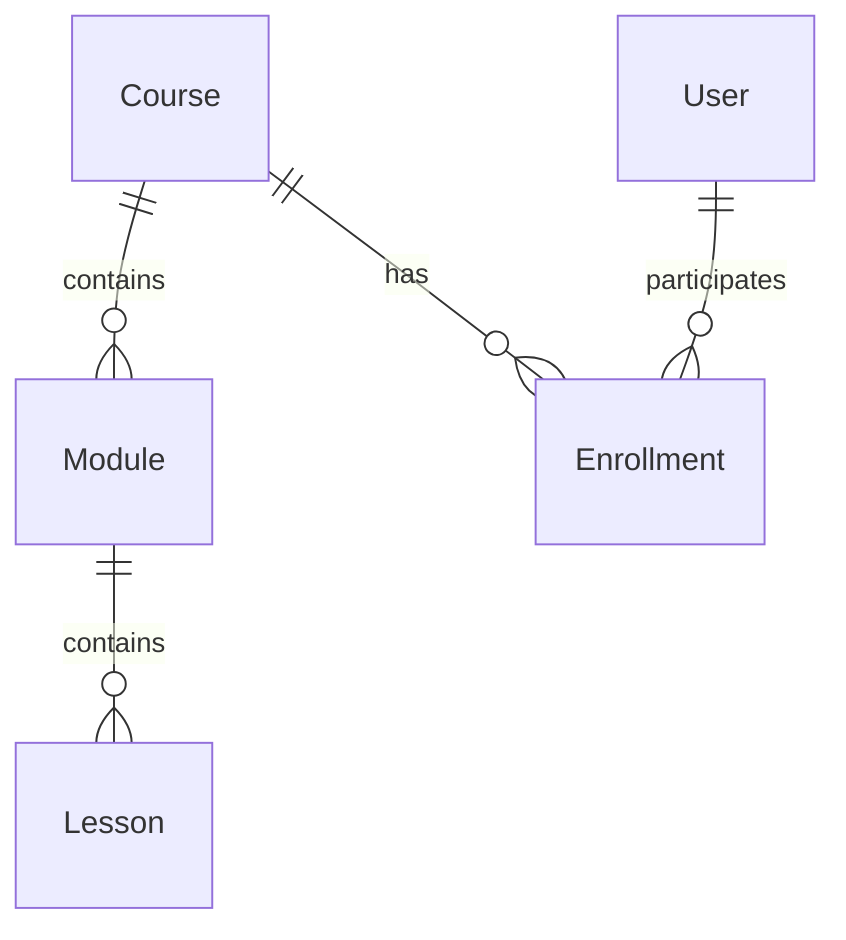

# Training Management System (TMS)
## System Documentation v1.0

## Table of Contents
1. [Introduction](#1-introduction)
2. [System Architecture](#2-system-architecture)
3. [Technical Stack](#3-technical-stack)
4. [Database Design](#4-database-design)
5. [Core Components](#5-core-components)
6. [Security Implementation](#6-security-implementation)
7. [API Documentation](#7-api-documentation)
8. [Testing Strategy](#8-testing-strategy)
9. [Deployment Guide](#9-deployment-guide)

## 1. Introduction

### 1.1 Purpose
The Training Management System (TMS) is a comprehensive platform designed to manage and deliver training programs. It provides functionality for course management, user administration, skill tracking, and progress monitoring.

### 1.2 Scope
The system encompasses:
- User Management with role-based access
- Course Creation and Management
- Skill and Achievement Tracking
- Progress Monitoring
- Assessment Management
- Calendar and Schedule Management

### 1.3 System Overview
The TMS is built using a microservices architecture with Django REST Framework backend and Next.js frontend. It implements advanced features like:
- JWT-based authentication
- Real-time progress tracking
- Advanced user activity monitoring
- Comprehensive skill management
- Achievement system
- File management

## 2. System Architecture

### 2.1 High-Level Architecture
```
Frontend (Next.js)          Backend (Django)           Database
     │                           │                         │
     ├── User Interface          ├── API Layer            ├── PostgreSQL
     ├── State Management        ├── Business Logic       ├── Migrations
     └── API Integration         └── Data Access          └── Indexes
```

### 2.2 Microservices Structure
```
apps/
├── users/              # User Management Service
├── courses/            # Course Management Service
└── calendar_app/       # Calendar Management Service
```

### 2.3 Component Interactions


## 3. Technical Stack

### 3.1 Backend Technologies
- **Framework**: Django 4.2.7
- **API**: Django REST Framework 3.14.0
- **Database**: PostgreSQL 14
- **Authentication**: JWT (djangorestframework-simplejwt)

### 3.2 Key Libraries
```python
# Backend Dependencies
django-cors-headers==4.3.0
django-filter==23.5
django-phonenumber-field==7.3.0
Pillow==10.1.0
django-simple-history==3.4.0
psycopg2-binary==2.9.9
django-environ==0.11.2
```

### 3.3 Frontend Technologies
- **Framework**: Next.js 13+
- **State Management**: React Query
- **UI Components**: Tailwind CSS
- **Authentication**: JWT with HTTP-only cookies

## 4. Database Design

### 4.1 Core Models
#### User Management


#### Course Management


Would you like me to continue with:
1. The remaining documentation sections?
2. More detailed diagrams?
3. Specific implementation details?
4. API specifications?

Each section will maintain this level of detail and professionalism. Let me know how you'd like to proceed!
